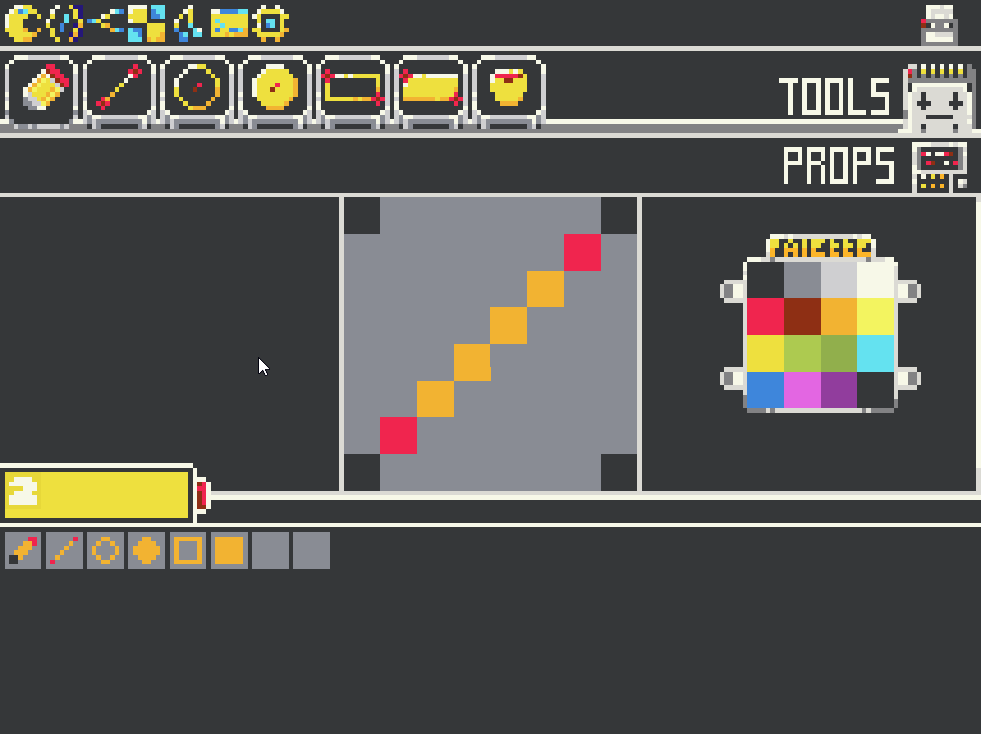
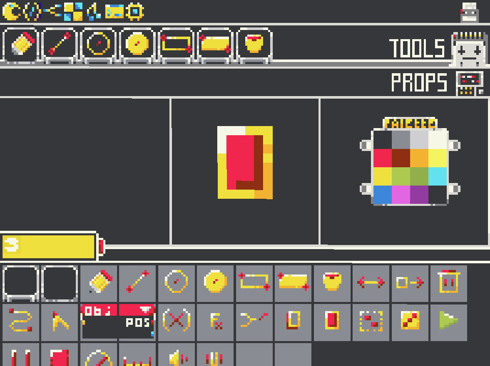
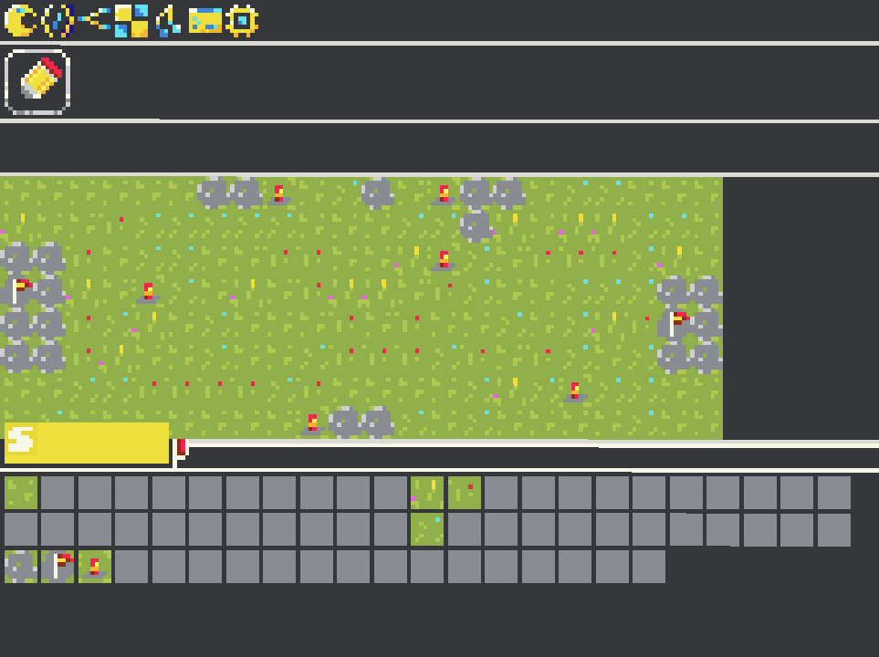
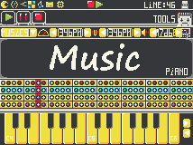
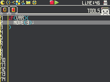

# Virtual Console

Virtual Console is an application that emulates computer with a limited resources

Specs:

- resolution: 214x160
- fps: 60
- languages: JavaScript (I will add more later)
- 10 atlases, 10 canvases, 10 tilemaps

## Demo



## Screenshots





## Concepts






## Build

Tested with MSVC on Windows 10

```
mkdir build
cd build
cmake ..
msbuild VirtualConsole.sln
```